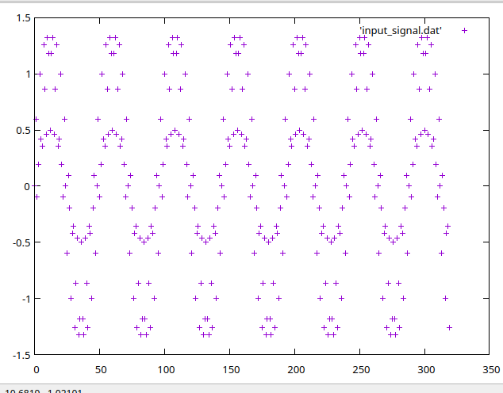

## Install gnuplot (Ubunut)
```
$ sudo apt-get install gnuplot
```
### Basic command of gnuplots

- Suppose we want to plot the data from an input file located in ./input/000_input.dat. We will have to go into a directory with input file.


- now let's plot the graph from the input file `input.dat`(data file is the format for binary data)

you will get something like: 

I'd be happy to provide a basic tutorial on gnuplot. Gnuplot is a powerful and versatile command-line graphing utility. Here's a concise introduction to get you started:

1. Installation:
   First, you'll need to install gnuplot. The method varies depending on your operating system.

2. Starting gnuplot:
   Open a terminal and type `gnuplot` to start the program.

3. Basic plotting:
   Let's start with a simple function plot:

   ```
   plot sin(x)
   ```

   This will display a graph of the sine function.

4. Customizing plots:
   You can add titles, labels, and change line styles:

   ```
   set title "Sine Wave"
   set xlabel "X axis"
   set ylabel "Y axis"
   plot sin(x) with lines
   ```

5. Plotting data from a file:
   If you have data in a file (e.g., 'data.txt'), you can plot it like this:

   ```
   plot "data.txt" using 1:2 with lines
   ```

   This plots column 2 vs column 1 from your data file.

6. Multiple plots:
   You can plot multiple functions or datasets on the same graph:

   ```
   plot sin(x), cos(x), tan(x)
   ```

7. Output to file:
   To save your plot as an image:

   ```
   set terminal png
   set output "myplot.png"
   plot sin(x)
   ```

8. Help and documentation:
   Type `help` in gnuplot for more information on commands.

Certainly, I'll provide some additional useful gnuplot commands, including navigating directories and more plotting options:

1. Changing directories:
   To change the working directory in gnuplot:
   ```
   cd "path/to/your/directory"
   ```
   For example:
   ```
   cd "/home/user/data"
   ```

2. Showing current directory:
   To display the current working directory:
   ```
   pwd
   ```

3. Listing files in the current directory:
   ```
   system "ls"
   ```
   (On Windows, use `system "dir"`)

4. Plotting with lines:
   You've already seen the basic `with lines` option. Here are more variations:

   a. Solid lines:
   ```
   plot sin(x) with lines
   ```

   b. Dashed lines:
   ```
   plot cos(x) with lines dashtype 2
   ```

   c. Different line colors:
   ```
   plot tan(x) with lines linecolor rgb "red"
   ```

   d. Varying line width:
   ```
   plot x**2 with lines linewidth 3
   ```

5. Combining line options:
   ```
   plot sin(x) with lines linecolor rgb "blue" linewidth 2 dashtype 3
   ```

6. Using different plot styles:
   ```
   plot sin(x) with points
   plot cos(x) with linespoints
   plot tan(x) with impulses
   ```

7. Setting the range for axes:
   ```
   set xrange [-5:5]
   set yrange [-1:1]
   plot sin(x)
   ```

8. Adding a grid:
   ```
   set grid
   plot sin(x)
   ```

9. Creating a multiplot:
   ```
   set multiplot layout 2,1
   plot sin(x)
   plot cos(x)
   unset multiplot
   ```

10. Saving and loading gnuplot commands:
    Save commands to a file:
    ```
    save "mycommands.gp"
    ```
    Load and execute commands from a file:
    ```
    load "mycommands.gp"
    ```

These additional commands should help you navigate directories and create more sophisticated plots in gnuplot. Would you like me to explain any of these further or provide examples for more advanced features?

#### Multiplot with colors 


Certainly! I'll provide more tutorials on plotting with colors and impulses, and I'll incorporate some of the commands from the provided gnuplot session. Let's expand on these concepts:

1. Plotting with colors:
   Gnuplot offers various ways to specify colors:

   a. Using named colors:
   ```
   plot sin(x) with lines lc rgb "red"
   plot cos(x) with lines lc rgb "blue"
   plot tan(x) with lines lc rgb "green"
   ```

   b. Using RGB values:
   ```
   plot sin(x) with lines lc rgb "#FF0000"  # Red
   plot cos(x) with lines lc rgb "#0000FF"  # Blue
   plot tan(x) with lines lc rgb "#00FF00"  # Green
   ```

   c. Using gnuplot's built-in color palette:
   ```
   plot sin(x) lc 1, cos(x) lc 2, tan(x) lc 3
   ```

2. Plotting with impulses:
   Impulse plots draw vertical lines from the x-axis to each data point:

   ```
   plot sin(x) with impulses
   ```

   You can combine this with color options:
   ```
   plot sin(x) with impulses lc rgb "red"
   ```

3. Multiplot layout:
   From the provided commands, we can see a multiplot setup. Here's how to create a 2x2 multiplot:

   ```
   set size 1,1
   set multiplot layout 2,2
   set size 0.5,0.5

   # Plot 1 (top-left)
   set origin 0,0.5
   plot '000_input_signal.dat' with lines lc rgb 'black'

   # Plot 2 (top-right)
   set origin 0.5,0.5
   plot 'output_rex.dat' with lines lc rgb 'red'

   # Plot 3 (bottom-left)
   set origin 0,0
   plot 'output_imx.dat' with lines lc rgb 'blue'

   # Plot 4 (bottom-right)
   set origin 0.5,0
   plot 'output_rex.dat' with impulses lc rgb 'green'

   unset multiplot
   ```

4. Customizing plot styles:
   You can combine different plot styles:

   ```
   plot '000_input_signal.dat' with lines lc rgb 'black' lw 2 title 'Input Signal', \
        'output_imx.dat' with points pt 7 ps 0.5 lc rgb 'blue' title 'IMX Output', \
        'output_rex.dat' with linespoints pt 5 ps 1 lc rgb 'red' title 'REX Output'
   ```

   This plots the input signal as a black line, IMX output as blue points, and REX output as red points connected by lines.

5. Setting ranges and labels:
   ```
   set xrange [0:100]
   set yrange [-1:1]
   set xlabel 'Time'
   set ylabel 'Amplitude'
   set title 'Signal Analysis'
   plot '000_input_signal.dat' with lines lc rgb 'black'
   ```

6. Adding a grid:
   ```
   set grid
   plot '000_input_signal.dat' with lines lc rgb 'black'
   ```

7. Saving the plot:
   ```
   set terminal png size 800,600
   set output 'signal_analysis.png'
   plot '000_input_signal.dat' with lines lc rgb 'black'
   ```

These examples should give you a good foundation for creating more complex and visually appealing plots in gnuplot. Remember, you can combine these techniques to create highly customized graphs. Would you like me to elaborate on any specific aspect or provide more advanced examples?
