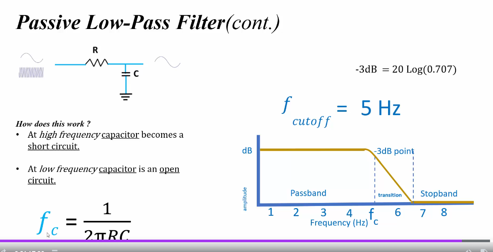

## How It Works

Simple explanation:
1. Low frequencies: The capacitor has time to charge and discharge, following the input signal
2. High frequencies: The capacitor can't charge/discharge fast enough, so it smooths out the signal

Technical explanation:
1. At low frequencies: The capacitor's impedance is high, so most of the voltage appears at the output
2. At high frequencies: The capacitor's impedance decreases, shunting more of the signal to ground

## Key Characteristics

1. Cutoff Frequency (fc)

Simple: The frequency at which the filter starts to significantly reduce the signal

Technical: The frequency at which the output power is half the input power (-3 dB point)

Formula: fc = 1 / (2π * R * C)

Where:
- fc is the cutoff frequency in Hz
- R is the resistance in ohms
- C is the capacitance in farads

2. Frequency Response

Simple: How the filter behaves at different frequencies

Technical: The magnitude and phase response of the filter as a function of frequency

Magnitude response formula:
|H(jω)| = 1 / sqrt(1 + (ω/ωc)²)

Where:
- |H(jω)| is the magnitude of the transfer function
- ω is the angular frequency (2πf)
- ωc is the cutoff angular frequency (2πfc)

3. Roll-off Rate

Simple: How quickly the filter reduces high-frequency signals

Technical: The rate of attenuation beyond the cutoff frequency

For a first-order RC filter: -20 dB/decade or -6 dB/octave

4. Time Constant (τ)

Simple: How quickly the circuit responds to changes

Technical: The time required to charge the capacitor to 63.2% of the final value

Formula: τ = R * C

## Practical Applications

1. Audio Systems: Reducing high-frequency noise in audio signals
2. Sensor Interfaces: Smoothing out rapid fluctuations in sensor readings
3. Power Supplies: Filtering out high-frequency noise from DC power lines
4. Communication Systems: Limiting bandwidth to prevent interference

## Advantages and Limitations

Advantages:
- Simple and inexpensive
- No external power required
- No risk of adding noise to the signal

Limitations:
- Fixed cutoff frequency (not easily adjustable)
- Gradual roll-off (-20 dB/decade)
- Loading effects can alter filter characteristics

## Example Calculation

Let's design a low-pass filter with a cutoff frequency of 1 kHz:

1. Choose C = 10 nF
2. Calculate R:
   R = 1 / (2π * fc * C)
   R = 1 / (2π * 1000 * 10e-9)
   R ≈ 15.9 kΩ

In practice, we might choose the nearest standard resistor value, such as 16 kΩ.

## Transfer Function

The transfer function of a first-order low-pass RC filter:

H(s) = 1 / (1 + s * R * C)

Where s is the complex frequency variable in the Laplace domain.

This transfer function describes the filter's behavior in both magnitude and phase across all frequencies.

