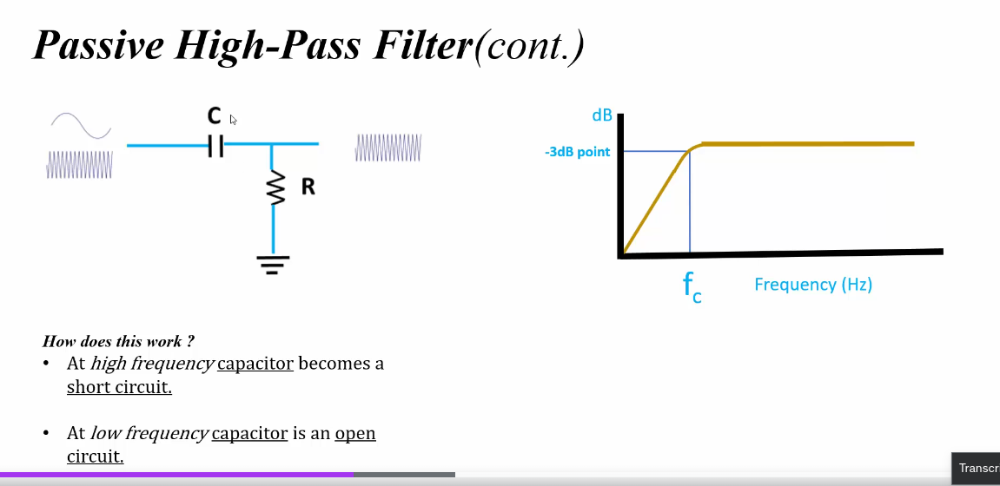

# Passive High Pass Filters: From Basics to Technical Details

## 1. Introduction to Filters

Filters are essential components in electronic circuits that allow certain frequencies to pass through while blocking others. They're used in various applications, from audio systems to communication devices.

## 2. What is a High Pass Filter?

A high pass filter (HPF) is a type of filter that allows high-frequency signals to pass through while attenuating (reducing the amplitude of) low-frequency signals.

- **Analogy**: Imagine a sieve that lets through large particles but blocks smaller ones. In this case, the "large particles" are high-frequency signals.

## 3. Passive vs. Active Filters

- **Passive filters** use only passive components like resistors, capacitors, and inductors.
- **Active filters** incorporate active components like operational amplifiers (op-amps) in addition to passive components.

We're focusing on passive high pass filters in these notes.

## 4. Basic Components of a Passive High Pass Filter

The simplest passive high pass filter consists of two components:

1. Resistor (R)
2. Capacitor (C)

## 5. Circuit Diagram of a Simple RC High Pass Filter

Here's a basic circuit diagram of an RC high pass filter:



## 6. How a Passive High Pass Filter Works

1. At low frequencies, the capacitor acts like an open circuit, blocking the signal.
2. At high frequencies, the capacitor acts like a short circuit, allowing the signal to pass through.
3. The resistor provides a path to ground, completing the circuit.

## 7. Key Characteristics

### 7.1 Cutoff Frequency (fc)

The cutoff frequency is the point at which the filter starts to take effect. It's defined as the frequency at which the output power is half the input power.

For an RC high pass filter:

```
fc = 1 / (2π * R * C)
```

Where:
- fc is the cutoff frequency in Hz
- R is the resistance in ohms
- C is the capacitance in farads

### 7.2 Frequency Response

The frequency response of a high pass filter shows how the filter affects signals of different frequencies:

- Below fc: Signal is attenuated at -20 dB/decade (first-order filter)
- At fc: Signal is attenuated by -3 dB (approximately 70.7% of original amplitude)
- Above fc: Signal passes with minimal attenuation

## 8. Transfer Function

The transfer function of a passive RC high pass filter in the s-domain is:

```
H(s) = s / (s + 1/(RC))
```

Where s is the complex frequency variable.

## 9. Phase Response

The phase response of a high pass filter shows how the filter affects the phase of input signals:

- At very low frequencies: 90° phase lead
- At fc: 45° phase lead
- At very high frequencies: 0° phase shift (no phase change)

## 10. Applications of Passive High Pass Filters

- Audio systems: Removing low-frequency noise or rumble
- Radio receivers: Separating high-frequency signals
- Digital systems: Removing DC offset
- Sensor interfaces: Filtering out low-frequency drift

## 11. Limitations and Considerations

- Passive filters can't amplify signals, only attenuate them
- Limited control over the exact shape of the frequency response
- Interaction with source and load impedances can affect performance
- Higher-order filters require more complex designs with multiple stages

## 12. Advanced Topics

### 12.1 Higher-Order Filters

Combining multiple first-order stages can create higher-order filters with steeper rolloff:
- Second-order: -40 dB/decade
- Third-order: -60 dB/decade

### 12.2 Butterworth, Chebyshev, and Bessel Responses

These are different filter designs that offer various tradeoffs between:
- Passband flatness
- Stopband attenuation
- Phase linearity
- Transient response

### 12.3 Impedance Matching

Proper impedance matching between the filter and surrounding circuits is crucial for optimal performance, especially in RF applications.

## Conclusion

Passive high pass filters are fundamental building blocks in electronics. While simple in construction, they offer powerful frequency-selective capabilities that are essential in many applications. Understanding their behavior and characteristics is key to effective circuit design and signal processing.
